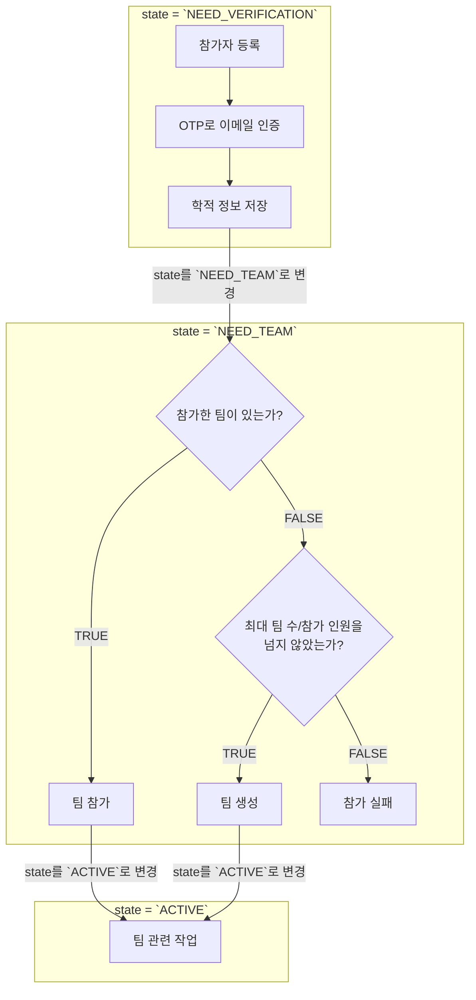

## 참가자 등록 과정 플로우 차트

참가자들의 등록 과정에 대한 플로우 차트입니다.

```mermaid
flowchart TB
  subgraph "state = `NEED_VERIFICATION`"
  create-member["참가자 등록"]
  email-verify["OTP로 이메일 인증"]
  input-student-info["학적 정보 저장"]
  end

  subgraph "state = `NEED_TEAM`"
  has-team{"참가한 팀이 있는가?"}
  is-max-participant-exceeded{"최대 팀 수/참가 인원을\n넘지 않았는가?"}
  create-team["팀 생성"]
  participate-team["팀 참가"]
  participant-failed["참가 실패"]
  end

  subgraph "state = `ACTIVE`"
  team-works["팀 관련 작업"]
  end

  create-member-->email-verify
  email-verify-->input-student-info
  input-student-info-->|"state를 `NEED_TEAM`로 변경"|has-team
  has-team-->|"TRUE"|participate-team
  has-team-->|"FALSE"|is-max-participant-exceeded
  is-max-participant-exceeded-->|"TRUE"|create-team
  is-max-participant-exceeded-->|"FALSE"|participant-failed
  create-team-->|"state를 `ACTIVE`로 변경"|team-works
  participate-team-->|"state를 `ACTIVE`로 변경"|team-works
```
